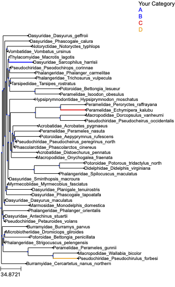

# A plugin for converting a [cogent3](https://github.com/cogent3/cogent3) tree to ete3 tree object 

Developed an app that takes a cogent3 `PhyloNode` then returns an ete3 `PhyloTree`, plus an app for edge colouring.

## cogent3 to ete3 tree
```
from cogent3_ete3 import trs_tree, extension
from cogent3 import load_tree

tree = load_tree("data/tree_large_scale.newick")

trs = trs_tree.cogent3_to_ete3()
t = trs(tree)
```

## colour edges by a mapping
```
mcats = {"Vombatidae_Vombatus_ursinus": "limit",
 "Dasyuridae_Sarcophilus_harrisii": "sympathetic",
 "Peramelidae_Echymipera_kalubu" : "chainsaw",
 "Pseudochiridae_Pseudochirulus_forbesi": "identity"}

cl = extension.colour_edge(mcats)
cl(t)
```

user can add legend of matrix categories to the plot

```
cl.add_legend(t)
```

will get:


